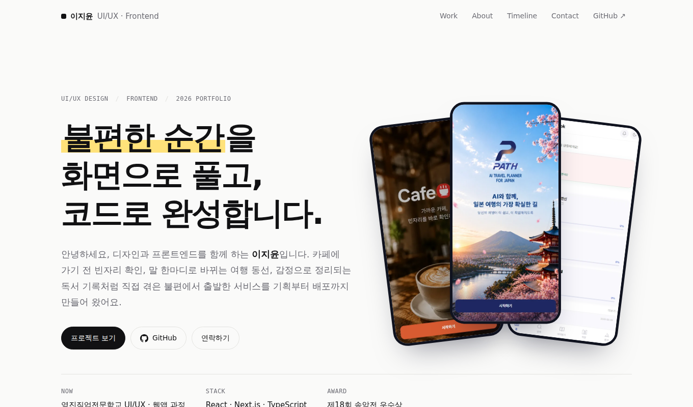

# 이지윤 포트폴리오

> 불편한 순간을 화면으로 풀고, 코드로 완성합니다.
> UI/UX 디자인과 프론트엔드를 함께 하는 이지윤의 포트폴리오 사이트입니다.

**🔗 사이트 바로가기** · https://portfolio-seven-kappa-dymq6ftb1l.vercel.app



<br>

## 📂 담긴 프로젝트

### 대표 프로젝트
| 프로젝트 | 설명 | 기간 | 인원 |
| --- | --- | --- | --- |
| **PATH** | AI와 대화하며 완성하는 일본 여행 플래너 | 2026.09 | 4명 |
| **CafeON** | 실시간 좌석 확인 · 주문 카페 서비스 (손님용 · 사장님용) | 2026.08 | 4명 |
| **JoinUs** | 다양한 기능을 담은 블로그형 웹사이트 | 2026.06 – 07 | 2명 |
| **MoodBook** | 감정을 읽어 주는 AI 독서 일기 · 🏆 송암전 우수상 | 2026.05 – 06 | 개인 |

### 그 밖의 작업
개인 블로그 · 영화 소개 사이트 · 모바일 청첩장 · Shopping Shot (크롬 확장 프로그램) · 시나모롤 카페

<br>

## ✨ 사이트 특징

- **실제 작업 화면 중심**: 각 프로젝트를 서비스 형태에 맞게 보여 줍니다. 모바일 서비스는 폰 화면, PC 서비스는 브라우저 창, 손님용 · 사장님용 서비스는 두 묶음으로 나눠 배치했습니다.
- **Problem → Solution → Details**: 프로젝트마다 해결한 문제, 해결 방법, 역할 · 기간 · 도구를 3단으로 요약했습니다.
- **타임라인**: 작업 기간을 날짜 단위 간트 차트로 그려 한 해 동안의 작업 흐름을 보여 줍니다.
- **인터랙션**: 스크롤 등장 애니메이션, 카드 3D 기울기, 스크롤 진행 바를 적용했습니다. 움직임 줄이기 설정을 켠 사용자에게는 애니메이션을 끕니다.
- **라이트 · 다크 모드**: 시스템 설정에 맞춰 자동으로 전환됩니다.
- **반응형**: PC와 모바일 화면 모두에 맞춰 레이아웃이 바뀝니다.

<br>

## 🛠 기술 스택

| 구분 | 사용 기술 |
| --- | --- |
| Markup · Style | HTML, CSS (CSS 변수, Grid, Flexbox, color-mix) |
| Script | Vanilla JavaScript (IntersectionObserver, Pointer Events) |
| Font | Geist, Geist Mono, IBM Plex Sans KR |
| Image | WebP (용량 최적화) |
| Deploy | Vercel |

라이브러리나 프레임워크 없이 HTML 파일 하나로 만들었습니다.

<br>

## ✏️ 내용 수정 방법

`index.html` 안의 `DATA` 객체만 고치면 사이트 내용이 바뀝니다.

| 항목 | 위치 |
| --- | --- |
| 상단 문구 | `headline`, `lede` |
| 상단 화면 3장 | `heroShots` |
| 대표 프로젝트 | `projects` (실제 화면은 `shots`) |
| 그 밖의 작업 | `others` |
| 소개 · 기술 | `aboutLead`, `aboutPoints`, `skills` |
| 연락처 | `email`, `github` |

<br>

## 📁 파일 구조

```
index.html          사이트 전체 (HTML · CSS · JS)
path-*.webp         PATH 화면
cafeon-*.webp       CafeON 화면
joinus-*.webp       JoinUs 화면
mood-*.webp         MoodBook 화면
docs/preview.png    README용 미리보기 이미지
```

<br>

## 📮 Contact

- Email · puremion@gmail.com
- GitHub · https://github.com/puremion-rgb
